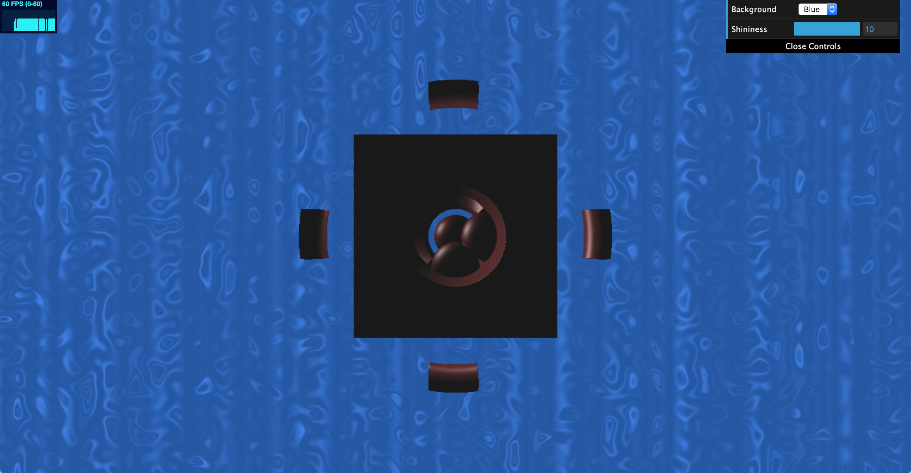

# Implicit Surfaces:
Name: Crystal Lee

PennKey: leecr

Email: leecr@seas.upenn.edu

[Website](www.crystaljlee.com)

## Live Project Demo
[Link](https://leecr97.github.io/implicit-surfaces/)

## Project Description
This project is a procedurally generated and animated scene created using a custom shader. It uses raymarching and signed distance functions to create implicit surfaces. 

Some background information: Raycasting is the process of casting "rays" from a virtual camera by creating a line that passes through the viewing frustum and travels from the eye to some endpoint on a slice of the frustum (e.g. the far clip plane). The line's endpoint is determined by the pixel on our screen from which we want to raycast.

Signed-distance functions are functions that, given a point p and our desires surface, returns a value that indicates how close p is to the surface. If p is on the surface, the SDF returns a value close to 0. If p is outside the surface, the SDF returns a positive float and if p is inside, the SDF returns a negative float.

SDFs can be combined with rays to create surfaces. To draw using SDFs, we simply march along a ray by generating points p until we find a point p that is on the surface of the SDF function. Once we know the location of the surface, we can render it by changing its color, estimating its normal, and using its normal to illuminate it. 

My scene is made of several implicit simple polygons that create more complex ones through boolean operations. For instance, we have a polygon in the center that is a continuous smooth blend of a sphere and a cube. This shape is then diffed with a separate shape that is a union of three cylinders, one on each axis. Additional visual complexity is created by three spheres that use a triangle wave function to slowly pass through the center shape, and a revolving shape that surrounds the scene that is created by intersecting a torus with two rectangular prisms that traverse the x and y axes using a sawtooth wave.

The polygons in the scene are illuminated using the Phong reflection model from a single light. This model uses the surface normal to calculate the amount of light the shape should receive at that point from a given light and its intensity. The illumination is calculated using other given parameters that determine the ambient color, diffuse color, specular color, and shininess coefficient.

In addition to the actual objects in the scene, the background of the scene is also textured using procedural noise functions. A height value is calculated at every point using two recursions of Perlin noise and exponential functions, and that height then determines the color of the background at that point.

Finally, some raymarching optimization along the lines of a Bounding Volume Hierarchy was used to help render the scene faster. When we raymarch, the first object we test the ray against is the bounding volume of the polygons in the scene. If it does not hit this bounding volume, then we know that the ray does not hit any of the polygons and we go straight to rendering the background. If it does hit the bounding volume, then we ray march from the bounds of this bounding volume to find the polygons in the scene. This helps speed up the rendering process both because we avoid unnecessary raymarching steps if a ray will not hit our scene, and we reduce the number of raymarching steps necessary for any ray that does hit our scene.

There is also a provided GUI that allows the user to modify certain aspects of the scene. The "background" field simply allows the user to change the background color into one of three preset options - blue, red, or gray. In addition, the user can also change the "shininess" coefficient of the Phong lighting model, which can lead to the materials looking much more metallic or plastic.

Click on the live demo to see it in action!

## References
[Volumetric Rendering: Signed Distance Functions](https://www.alanzucconi.com/2016/07/01/signed-distance-functions/#part1) by Alan Zucconi

[Ray Marching and Signed Distance Functions](http://jamie-wong.com/2016/07/15/ray-marching-signed-distance-functions/) by Jamie Wong

[Distance Functions](http://www.iquilezles.org/www/articles/distfunctions/distfunctions.htm) by Inigo Quilez

[Phong reflection model](https://en.wikipedia.org/wiki/Phong_reflection_model)